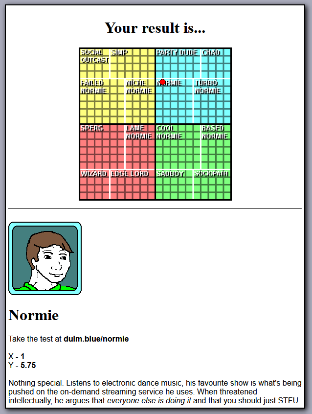

# normie-neural-networks

Do you like memes's (DULM) Normie Test is a quiz with ~40 questions that places the taker on a two-axes plot relative to internet culture personality classes like 'normies' and 'simps.' Notably, the quiz is not open source and it runs on server-side PHP.

This repo documents an attempted reverse-engineering of the Normie Test.

The Normie Test's first 20 questions are called the 'perspective questions' meant to determine the quiz taker's outlook on life. Questions 21-34 are the 'actual' or 'normie' questions which are meant to determine whether the quiz taker is a 'normie'. Questions 35-41 are 'statistical' -- asking the quiz taker their height, BMI, climate, etc. for reference.

Once the quiz is submitted, the quiz taker receives their resulting class and a pair of X and Y coordinates.



Scraped data can be found in `data-m111111-ignore-stats.csv` and `data-stats-combs.csv`. The former records answers to the perspective and normie questions and the XY coordinates for fixed answers to the stats questions. See `script.js` to see how it was generated. The latter records answers to all the questions, XY coordinates, and resulting classes for all combinations of answers to the stats questions. See `scrape.py` for how it was generated.

## Run locally

### Analysis

```
python3 -m venv env
source env/bin/activate
pip install -r requirements.txt
python <lin_reg.py/stat_diffs.py/nn.py/classify.py>
```

### Scraping

- Download the Selenium webdriver for your browser
- Making sure it is in your path run the driver
- In another terminal, run `python scrape.py`

## Conclusions

### XY coordinates

We discover that the Yes-No questions contribute to the X coordinates and have weights that are either 1 or 0.5 towards a positive or negative value of X. Additionally, if the quiz taker answers that they are male, female, or other, the corresponding effect on their X coordinate is -2, 1.5, 1, respectively.

The questions whose options are 'strongly yes', 'yes', 'neutral', 'no', and 'strongly no' (DULM calls these dynamic questions) contribute to the Y coordinates. The weights for these options are 0 for neutral, 0.25 for yes/no, and 1 for strongly yes/strongly no. Again, the weights may have a positive or negative effect on the Y coordinate.

See `weights.csv` for details. It was generated using linear regression (See `lin_reg.py`). To prevent this repo's wonderfully alliterative name from being a misnomer, `nn.py` is included where a neural network is instead used for regression.

### Stats Corrections

Unfortunately, DULM does not give much info about the stats questions. Recently, they released some aggregate statistics like those in `stats.json`, but they are not helpful (no XY means, covariances, etc -- you cannot even know counts related to specific answers to the stats questions due to vague labels like 'tall' which does not carry information about the short and average height counts).

Accounting for the weights, the specific combination of answers to the stats questions have their own effect on the XY coordinates. There are 14400 combinations. Each of their effects on the XY coordinates are recorded in `stat-corrections.csv`. It was generated by `stat_diffs.py`. These may change as DULM collects more data from quiz takers and the statistics change. This is the main limit to this particular approach of reverse-engineering the test.

### Classification

The white dividing lines seen on the results page diagram are misleading. The actual class boundaries are measured in intervals of 0.5 for the X coordinates and 0.25 for the Y coorinates. They can be found in `classify.py`.
